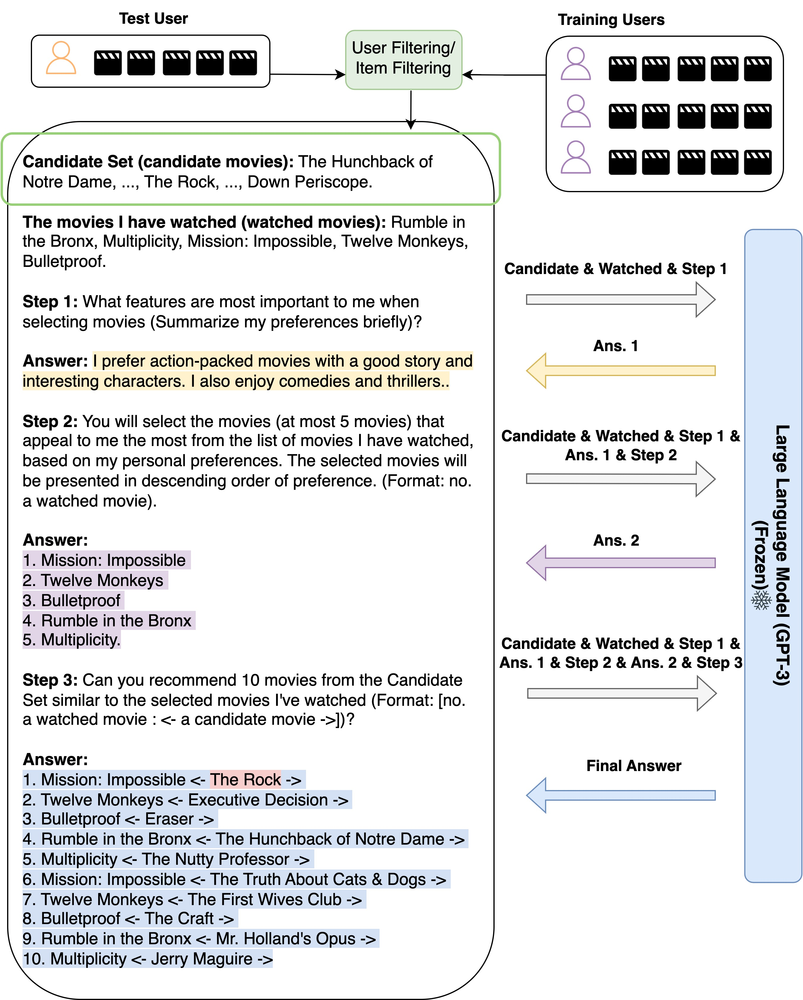

# LLM4Rec
Paper List of Recommender Systems with Large Language Models

## Related Repositories

|                                                        Repo Name                                                         |                 Maintainer                  |
|:------------------------------------------------------------------------------------------------------------------------:|:-------------------------------------------:|
|                            [rs-llm-paper-list](https://github.com/wwliu555/rs-llm-paper-list)                            |   [wwliu555](https://github.com/wwliu555)   |
| [awesome-recommend-system-pretraining-papers](https://github.com/archersama/awesome-recommend-system-pretraining-papers) | [archersama](https://github.com/archersama) |
|                                        [LLM4Rec](https://github.com/WLiK/LLM4Rec)                                        |       [WLiK](https://github.com/WLiK)       |
|                       [Awesome-LLM4RS-Papers](https://github.com/nancheng58/Awesome-LLM4RS-Papers)                       | [nancheng58](https://github.com/nancheng58) |
|                               [Awesome-recsys](https://github.com/creyesp/Awesome-recsys)                                |    [creyesp](https://github.com/creyesp)    |
|                   [Awesome-Generative-RecSys](https://github.com/jihoo-kim/Awesome-Generative-RecSys)                    |  [jihoo-kim](https://github.com/jihoo-kim)  |

## Tasks

### Overview

首先考虑模型的**数据**，推荐系统的数据是时序、多模态的。

- 对于用户有两个历史记录：
	- 用户个人背景
	- 用户使用此平台的操作历史

推荐系统的**任务**就是根据某一时间点之前的信息，向用户推荐新的内容。

- 对于模型需要输出：
	- 详细具体的推荐内容
	- 具有说服力的解释

推荐系统评价指标通常较难获取，但是用户的反馈却比其他任务更容易获得。

- 损失函数明确的任务
	- 序列推荐
	- 评分预测
- 损失函数不明确的任务
	- 解释生成

输入数据的多少并不是划分推荐任务的关键因素。输出结果的粒度十分重要。

Ideally, given user $u_i$, the platform will get his background $b_i$ and browsing history $h_i$. For any content $c_i$ from the recommender system, user $u_i$ has a certain like/interest level. This level can be expressed as a value in the range 0 to 1. The different values of different contents indicate how high or low the user evaluates it. The final recommendation system will make recommendations based on user preferences.

以上是最理想的推荐系统，如果要求降低，用户对一个内容的态度可以简化为用户评分，即**评分预测**任务；如果不直接对每一个内容进行打分，直接选出用户最喜欢的几项，则可以得到**序列推荐**任务；如果同时还不考虑时序数据包含的信息，则任务变成了**直接推荐**。每一个任务都包含了推荐系统做出的妥协。

在将LLM应用到推荐系统中的时候，LLM的作用也有不同的可能性。

### Classification by Liu

> Is ChatGPT a Good Recommender? A Preliminary Study

#### Accuracy-based tasks

- **评分预测（Rating Prediction）**：评分预测旨在预测用户对特定项目的评分，如上图所示，黑字部分代表任务的描述，评分预测被翻译为“How will user rate this product_title?”，灰字表示当前的输入，即要求用户评分的项目，红字表示针对输出的格式要求，在评分预测任务中，要求有“1 being lowest and 5 being highest”和“Just give me back the exact number a result”；
- **序列推荐（Sequential Recommendation）**：序列推荐任务要求系统根据用户过去的序贯行为预测其之后的行为，如上图所示，论文为该任务设计了三种 Prompt 格式，分别是基于交互历史直接预测用户的下一个行为，从候选列表中选出可能的下一个行为以及判断指定行为成为用户下一个行为的可能性；
- **直接推荐（Direct Recommendation）**：直接推荐指通过利用用户评分或评论信息直接显示反馈推荐的任务，论文将这一任务的 Prompt 设计为从潜在的候选项中选择出最适合的一项；
	- News Recommendation
	- Group Recommendation
	- Movie Recommendation

#### Explainability-oriented tasks

- **解释生成**：解释生成是为用户提供解释以澄清为什么会推荐此项的推荐系统任务，具体地，如上图所示，论文要求 ChatGPT 生成一个文本解释，以阐明解释生成过程，对每个类别，可以包含如提示词或星级评分等的辅助信息；
- **评论总结**：旨在使用推荐系统自动生成用户评论摘要。通过输入用户的评论信息，Prompt 提示推荐系统总结评论的主要含义。

## Paradigms

### Classification by Wu

> A Survey on Large Language Models for Recommendation

在将LLM应用到推荐系统中的时候，LLM的作用也有不同的可能性/位置/角色。目前根据LLM的作用，可以将LLM for Rec中LLM的作用分类为：

- Embedding
	- 用LLM做特征提取，再使用推荐系统进行推荐
- Token generation
	- 用LLM提取文本的重点信息，但仍然输出文本，最后使用推荐系统利用这些文本进行推荐
- Recommendation
	- 直接让LLM给出推荐结果

## Taxonomy

### Theory by Wu

核心要决定的是，是否让LLM进行推荐。目前的趋势来看，还是让LLM直接做推荐符合潮流，并且这样也免去了还要单独提供一个推荐系统的麻烦。

#### Discriminative LLM4Rec

以BERT为首的、用编码器的LLM，主要用于Embedding特征提取，输出的结果再传递给下游模型。这类模型主要用于解决**Embedding**问题，也就是不直接做推荐。

#### Generative LLM4Rec

以GPT为首的，用解码器的LLM。这类模型主要用于解决**Token generation**和**Recommendation**问题，也就是GPT可以特征总结，也可以直接做推荐。

## Papers

### Surveys

| Paper                                                                                                                                                              | Publication | Year        |
| ------------------------------------------------------------------------------------------------------------------------------------------------------------------ | ----------- | ----------- |
| [Self-Supervised Learning for Recommender Systems: A Survey](https://arxiv.org/abs/2203.15876)                                                                     | arXiv       | 29 Mar 2022 |
| [Pre-train, Prompt and Recommendation: A Comprehensive Survey of Language Modelling Paradigm Adaptations in Recommender Systems](https://arxiv.org/abs/2302.03735) | arXiv       | 7 Feb 2023  |
| [A Survey on Large Language Models for Recommendation](https://arxiv.org/abs/2305.19860)                                                                           | arXiv       | 31 May 2023 |
| [How Can Recommender Systems Benefit from Large Language Models: A Survey](https://arxiv.org/abs/2306.05817)                                                       | arXiv       | 9 Jun 2023  |

### Paradigms of LLM4Rec
创作者端

#### Content creator oriented

##### Content generation

| Name    | Paper                                                                                          | Publication    | Repository                                      | Link                                                 |
| ------- | ---------------------------------------------------------------------------------------------- | -------------- | ----------------------------------------------- | ---------------------------------------------------- |
| GenRead | [Generate rather than Retrieve Large Language Models are Strong Context Generators](#Generate%20rather%20than%20Retrieve%20Large%20Language%20Models%20are%20Strong%20Context%20Generators) | ICLR 2023      | [GenRead](https://github.com/wyu97/GenRead)     | [arXiv:2209.10063](https://arxiv.org/abs/2209.10063) |
| GeneRec | [Generative Recommendation Towards Next-generation Recommender Paradigm](#Generative%20Recommendation%20Towards%20Next-generation%20Recommender%20Paradigm)                    | arXiv preprint | [GeneRec](https://github.com/Linxyhaha/GeneRec) | [arXiv:2304.03516](https://arxiv.org/abs/2304.03516) |
| GENRE   | [[#A First Look at LLM-Powered Generative News Recommendation]]                                | arXiv preprint |                                                 | [arXiv:2305.06566](https://arxiv.org/abs/2305.06566) | 

#### User oriented
用户端

##### Query generation

| Name | Paper                                                                               | Publication    | Repository | Link                                                 |
| ---- | ----------------------------------------------------------------------------------- | -------------- | ---------- | ---------------------------------------------------- |
| GPT4Rec  | [GPT4Rec A Generative Framework for Personalized Recommendation and User Interests Interpretation](#GPT4Rec%20A%20Generative%20Framework%20for%20Personalized%20Recommendation%20and%20User%20Interests%20Interpretation) | arXiv preprint |            | [arXiv:2304.03879](https://arxiv.org/abs/2304.03879) |

#### Platform oriented
平台端

##### Recommendation classified by timing

###### Direct recommendation
不考虑时间维度，直接通过用户提供的查询进行推荐

| Name    | Paper                                                    | Publication    | Repository                                                          | Link                                                 |
| ------- | -------------------------------------------------------- | -------------- | ------------------------------------------------------------------- | ---------------------------------------------------- |
| DSI | [[#Transformer Memory as a Differentiable Search Index]] | NeurIPS 2022   | [DSI-transformers](https://github.com/ArvinZhuang/DSI-transformers) | [arXiv:2202.06991](https://arxiv.org/abs/2202.06991) |
|         | [[#Is ChatGPT a Good Recommender? A Preliminary Study]]  | arXiv preprint |                                                                     | [arXiv:2304.10149](https://arxiv.org/abs/2304.10149) |

###### Sequential recommendation
加入时间维度，考虑用户的历史进行推荐

| Name        | Paper                                                                                                      | Publication    | Repository                                                                | Link                                                 |
| ----------- | ---------------------------------------------------------------------------------------------------------- | -------------- | ------------------------------------------------------------------------- | ---------------------------------------------------- |
| NIR         | Zero-Shot Next-Item Recommendation using Large Pretrained Language Models                             | arXiv preprint | [LLM-Next-Item-Rec](https://github.com/AGI-Edgerunners/LLM-Next-Item-Rec) | [arXiv:2304.03153](https://arxiv.org/abs/2304.03153) |
|             | Is ChatGPT a Good Recommender? A Preliminary Study                                                    | arXiv preprint |                                                                           | [arXiv:2304.10149](https://arxiv.org/abs/2304.10149) |
| TALLRec | TALLRec An Effective and Efficient Tuning Framework to Align Large Language Model with Recommendation | arXiv preprint | [TALLRec](https://github.com/SAI990323/TALLRec)                           | [arXiv:2305.00447](https://arxiv.org/abs/2305.00447) |
| TIGER   | Recommender Systems with Generative Retrieval                                                         | arXiv preprint |                                                                           | [arXiv:2305.05065](https://arxiv.org/abs/2305.05065) |
|             | How to Index Item IDs for Recommendation Foundation Models                                            | arXiv preprint |                                                                           | [arXiv:2305.06569](https://arxiv.org/abs/2305.06569) |
|             | Recommendation as Instruction Following A Large Language Model Empowered Recommendation Approach      | arXiv preprint |                                                                           | [arXiv:2305.07001](https://arxiv.org/abs/2305.07001) |
|             | Large Language Models are Zero-Shot Rankers for Recommender Systems                                   | arXiv preprint | [LLMRank](https://github.com/RUCAIBox/LLMRank)                            | [arXiv:2305.08845](https://arxiv.org/abs/2305.08845) | 

##### Recommendation classified by query

###### Proactively recommendation

| Name | Paper                                                                               | Publication    | Repository | Link                                                 |
| ---- | ----------------------------------------------------------------------------------- | -------------- | ---------- | ---------------------------------------------------- |
|             | [[#Recommendation as Instruction Following A Large Language Model Empowered Recommendation Approach]]      | arXiv preprint |                                                                           | [arXiv:2305.07001](https://arxiv.org/abs/2305.07001) | 

###### Passively recommendation

##### Ranking

| Name | Paper                                                                               | Publication    | Repository | Link                                                 |
| ---- | ----------------------------------------------------------------------------------- | -------------- | ---------- | ---------------------------------------------------- |
| Chat-REC  | [Chat-REC Towards Interactive and Explainable LLMs-Augmented Recommender System](#Chat-REC%20Towards%20Interactive%20and%20Explainable%20LLMs-Augmented%20Recommender%20System) | arXiv preprint |            | [arXiv:2303.14524](https://arxiv.org/abs/2303.14524) |
	|             | [Large Language Models are Zero-Shot Rankers for Recommender Systems](#Large%20Language%20Models%20are%20Zero-Shot%20Rankers%20for%20Recommender%20Systems)                                   | arXiv preprint | [LLMRank](https://github.com/RUCAIBox/LLMRank)                            | [arXiv:2305.08845](https://arxiv.org/abs/2305.08845) | 

##### Rating prediction

| Name | Paper                                                   | Publication    | Repository | Link                                                 |
| ---- | ------------------------------------------------------- | -------------- | ---------- | ---------------------------------------------------- |
|      | [[#Is ChatGPT a Good Recommender? A Preliminary Study]] | arXiv preprint |            | [arXiv:2304.10149](https://arxiv.org/abs/2304.10149) |
|      | [[#Do LLMs Understand User Preferences? Evaluating LLMs On User Rating Prediction]] | arXiv preprint |            | [arXiv:2305.06474](https://arxiv.org/abs/2305.06474) |

##### Representation

##### ID generation

| Name      | Paper                                                           | Publication    | Repository                                                          | Link                                                 |
| --------- | --------------------------------------------------------------- | -------------- | ------------------------------------------------------------------- | ---------------------------------------------------- |
| DSI   | [[#Transformer Memory as a Differentiable Search Index]]        | NeurIPS 2022   | [DSI-transformers](https://github.com/ArvinZhuang/DSI-transformers) | [arXiv:2202.06991](https://arxiv.org/abs/2202.06991) |
| TIGER | [[#Recommender Systems with Generative Retrieval]]              | arXiv preprint |                                                                     | [arXiv:2305.05065](https://arxiv.org/abs/2305.05065) |
|           | [[#How to Index Item IDs for Recommendation Foundation Models]] | arXiv preprint |                                                                     | [arXiv:2305.06569](https://arxiv.org/abs/2305.06569) |

##### Explanation Generation

| Name | Paper                                                   | Publication    | Repository | Link                                                 |
| ---- | ------------------------------------------------------- | -------------- | ---------- | ---------------------------------------------------- |
|      | [[#Is ChatGPT a Good Recommender? A Preliminary Study]] | arXiv preprint |            | [arXiv:2304.10149](https://arxiv.org/abs/2304.10149) |

##### Review summarization

| Name | Paper                                                   | Publication    | Repository | Link                                                 |
| ---- | ------------------------------------------------------- | -------------- | ---------- | ---------------------------------------------------- |
|      | [[#Is ChatGPT a Good Recommender? A Preliminary Study]] | arXiv preprint |            | [arXiv:2304.10149](https://arxiv.org/abs/2304.10149) |

### Training of LLM4Rec

#### Tuning

| Name        | Paper                                                                                                      | Publication    | Repository                                      | Link                                                 |
| ----------- | ---------------------------------------------------------------------------------------------------------- | -------------- | ----------------------------------------------- | ---------------------------------------------------- |
| TALLRec | [[#TALLRec An Effective and Efficient Tuning Framework to Align Large Language Model with Recommendation]] | arXiv preprint | [TALLRec](https://github.com/SAI990323/TALLRec) | [arXiv:2305.00447](https://arxiv.org/abs/2305.00447) |
|      | [[#Web Content Filtering through knowledge distillation of Large Language Models]] | arXiv preprint |            | [arXiv:2305.05027](https://arxiv.org/abs/2305.05027) |
|             | [[#Recommendation as Instruction Following A Large Language Model Empowered Recommendation Approach]]      | arXiv preprint |                                                                           | [arXiv:2305.07001](https://arxiv.org/abs/2305.07001) | 

#### Model compression

| Name | Paper                                                                              | Publication    | Repository | Link                                                 |
| ---- | ---------------------------------------------------------------------------------- | -------------- | ---------- | ---------------------------------------------------- |
|      | [[#Web Content Filtering through knowledge distillation of Large Language Models]] | arXiv preprint |            | [arXiv:2305.05027](https://arxiv.org/abs/2305.05027) |

### Evaluation of LLM4Rec

#### Performance

| Name   | Paper                                                                                                | Publication    | Repository                                           | Link                                                 |
| ------ | ---------------------------------------------------------------------------------------------------- | -------------- | ---------------------------------------------------- | ---------------------------------------------------- |
| iEvaLM | [Rethinking the Evaluation for Conversational Recommendation in the Era of Large Language Models](#Rethinking%20the%20Evaluation%20for%20Conversational%20Recommendation%20in%20the%20Era%20of%20Large%20Language%20Models) | arXiv preprint | [iEvaLM-CRS](https://github.com/RUCAIBox/iEvaLM-CRS) | [arXiv:2305.13112](https://arxiv.org/abs/2305.13112) | 

#### Fairness

| Name    | Paper                                                                                               | Publication    | Repository                                        | Link                                                 |
| ------- | --------------------------------------------------------------------------------------------------- | -------------- | ------------------------------------------------- | ---------------------------------------------------- |
| FaiRLLM | [Is ChatGPT Fair for Recommendation? Evaluating Fairness in Large Language Model Recommendation](#Is%20ChatGPT%20Fair%20for%20Recommendation?%20Evaluating%20Fairness%20in%20Large%20Language%20Model%20Recommendation) | arXiv preprint | [FaiRLLM](https://github.com/jizhi-zhang/FaiRLLM) | [arXiv:2305.07609](https://arxiv.org/abs/2305.07609) | 

#### Privacy

### Techniques *

#### LLM using tools

| Name    | Paper                                                                                          | Publication    | Repository                                      | Link                                                 |
| ------- | ---------------------------------------------------------------------------------------------- | -------------- | ----------------------------------------------- | ---------------------------------------------------- |
| GeneRec | [Generative Recommendation Towards Next-generation Recommender Paradigm](#Generative%20Recommendation%20Towards%20Next-generation%20Recommender%20Paradigm)                    | arXiv preprint | [GeneRec](https://github.com/Linxyhaha/GeneRec) | [arXiv:2304.03516](https://arxiv.org/abs/2304.03516) |

### Other directions

#### Question answering *

| Name    | Paper                                                                       | Publication    | Repository                                      | Link                                                 |
| ------- | --------------------------------------------------------------------------- | -------------- | ----------------------------------------------- | ---------------------------------------------------- |
| Atlas   | [Atlas Few-shot Learning with Retrieval Augmented Language Models](#Atlas%20Few-shot%20Learning%20with%20Retrieval%20Augmented%20Language%20Models)       | arXiv preprint |                                                 | [arXiv:2208.03299](https://arxiv.org/abs/2208.03299) |
| GeneRec | [[#Generative Recommendation Towards Next-generation Recommender Paradigm]] | arXiv preprint | [GeneRec](https://github.com/Linxyhaha/GeneRec) | [arXiv:2304.03516](https://arxiv.org/abs/2304.03516) |

#### Fact checking *

| Name    | Paper                                                                       | Publication    | Repository                                      | Link                                                 |
| ------- | --------------------------------------------------------------------------- | -------------- | ----------------------------------------------- | ---------------------------------------------------- |
| Atlas   | [Atlas Few-shot Learning with Retrieval Augmented Language Models](#Atlas%20Few-shot%20Learning%20with%20Retrieval%20Augmented%20Language%20Models)       | arXiv preprint |                                                 | [arXiv:2208.03299](https://arxiv.org/abs/2208.03299) |

#### Dialog generation

| Name    | Paper                                                                       | Publication    | Repository                                      | Link                                                 |
| ------- | --------------------------------------------------------------------------- | -------------- | ----------------------------------------------- | ---------------------------------------------------- |
| Atlas   | [Atlas Few-shot Learning with Retrieval Augmented Language Models](#Atlas%20Few-shot%20Learning%20with%20Retrieval%20Augmented%20Language%20Models)       | arXiv preprint |                                                 | [arXiv:2208.03299](https://arxiv.org/abs/2208.03299) |

#### Slot-filling

| Name    | Paper                                                                       | Publication    | Repository                                      | Link                                                 |
| ------- | --------------------------------------------------------------------------- | -------------- | ----------------------------------------------- | ---------------------------------------------------- |
| Atlas   | [Atlas Few-shot Learning with Retrieval Augmented Language Models](#Atlas%20Few-shot%20Learning%20with%20Retrieval%20Augmented%20Language%20Models)       | arXiv preprint |                                                 | [arXiv:2208.03299](https://arxiv.org/abs/2208.03299) |

#### Entity linking

| Name    | Paper                                                                       | Publication    | Repository                                      | Link                                                 |
| ------- | --------------------------------------------------------------------------- | -------------- | ----------------------------------------------- | ---------------------------------------------------- |
| Atlas   | [Atlas Few-shot Learning with Retrieval Augmented Language Models](#Atlas%20Few-shot%20Learning%20with%20Retrieval%20Augmented%20Language%20Models)       | arXiv preprint |                                                 | [arXiv:2208.03299](https://arxiv.org/abs/2208.03299) |

### List

##### Transformer Memory as a Differentiable Search Index

> [!info]
> NeurIPS 2022
> 
> [arXiv:2202.06991](https://arxiv.org/abs/2202.06991) [cs.CL]
> 
> [[#ID generation]] + Re-ranking/LLM as Recommender
> 
> Note: [[DSI]]

本质是让LLMs去做[[Information retrieval]]，之前的模型，无论是传统模型还是机器学习模型，都是对问题和文档进行一对一比较，最后挑选相关性较高的结果。但是这个模型设计了文档的索引机制，输入问题，输出文档索引（使用beam search输出多个）。也算是端到端了。但是并不完全，毕竟这里文档的索引仍然需要id，真正的端到端肯定是直接输出结果。

#### Atlas: Few-shot Learning with Retrieval Augmented Language Models

> [arXiv:2208.03299](https://arxiv.org/abs/2208.03299) [cs.CL]
> 
> Retriever + LLMs as Content Refiner + Fine-tuning

设计了4种损失函数，用于训练LLM来做推荐任务。模型架构包括Retriever和Ranker，其中Ranker就是LLM。

> 在知识密集型任务当中，使用检索增强的语言模型能够拥有很好的表现，并且不需要很大的参数量。但是，对于few-shot场景下，检索能否有效增强语言模型的能力还不得而知。基于这个问题，作者提出了Atlas，一个预训练的检索增强语言模型，只需要使用非常少的训练样本就能够学习和处理知识密集型任务。
> 
> 具体来说，作者使用了一个叫Contriever的Retriever，而使用的LLM为T5。在训练过程中，作者使用了ADist，EMDR^2，PDist和LOOP四个训练目标对检索器和语言模型进行联合训练。同时，作者也使用了无监督的方式进行联合训练，包括Prefix language modeling，Masked language modeling和Title to section generation。在实验方面，使用了KILT，MMLU和一些其他的问答数据集对Atlas进行了测试，证明了检索增强的有效性。

Re-rank部分是由Retriever完成的，而不是LLM。

#### Generate rather than Retrieve: Large Language Models are Strong Context Generators

> ICLR 2023
> 
> [arXiv:2209.10063](https://arxiv.org/abs/2209.10063) [cs.CL]
> 
> [Content generation](#Content%20generation)

将LLMs输出的结果连同之前的输入，再次作为输入给到LLMs，难绷

文章主要思想是使用大语言模型自动生成文档级别Prompt，使得在问答任务上效果更好

基于的观察是给大模型提供的问题信息越丰富，GPT给出的答案就越准确。似乎大语言模型学过的东西需要一点提示和回忆才会想起来正确结果。结果证明大模型二次预测效果更好，与传统方法一起使用更佳

#### Chat-REC: Towards Interactive and Explainable LLMs-Augmented Recommender System

> [arXiv:2303.14524](https://arxiv.org/abs/2303.14524) [cs.IR]
> 
> Retriever + [Ranking](#Ranking) + Fine-tuning

将传统推荐系统和LLM模型合并使用，主要以工程为主。本质还是候选物的re-rank。

文章设计了整个用户提问的流程，穿插使用GPT和传统推荐系统。主要思路是将推荐系统的结果让GPT再过滤排序一遍

#### Zero-Shot Next-Item Recommendation using Large Pretrained Language Models

> [arXiv:2304.03153](https://arxiv.org/abs/2304.03153) [cs.IR]
> 
> Traditional retriever + LLM Ranking + [Sequential recommendation](#Sequential%20recommendation)
> 
> Repository: https://github.com/AGI-Edgerunners/LLM-Next-Item-Rec

最简单的似乎不需要训练模型的方法，使用三段式提问让LLMs输出结果

> 本文评测了零样本设定下，LLM在下一个物品预测任务下的能力。本文提出了两个挑战：1. 对于LLM来说，推荐的候选空间非常大，2. LLM不清楚用户的历史交互和偏好。为此，本文提出了一种提示策略：“Zero-Shot Next-Item Recommendation (NIR)”， 使得LLM可以处理预测下一个物品的任务。具体来说，本文首先利用外部模块（传统的协同过滤模型）生成候选物品，然后分别提示LLM：1. 提取用户偏好，2. 选择代表性的历史交互物品， 3. 推荐并排序包含十个物品的列表。本文结果表明GPT-3在MovieLens 100K数据集上具有较强的零样本能力，甚至可以优于在该数据集上完整训练的传统推荐模型。

#### Generative Recommendation: Towards Next-generation Recommender Paradigm

> [arXiv:2304.03516](https://arxiv.org/abs/2304.03516) [cs.IR]
> 
> LLM using tools + [Content generation](#Content%20generation)
> 
> Repository: https://github.com/Linxyhaha/GeneRec

直接跳出了推荐系统原有的范式，即互联网公司有什么就推荐什么，而是将内容创作也交给了推荐系统来做。

> 本文作者认为传统的推荐模型往往从物品集合中检索合适的物品来实现个性化推荐。然而，这样的范式可能存在一些问题：1. 已有的人类生成的物品集合并不一定能符合用户多样化的需求， 2. 用户往往通过被动的，低效的反馈（如点击），来调节推荐。基于AIGC的蓬勃发展，作者构想的下一代的推荐范式应该具有以下两个目标：1. 通过生成式AI来生成个性化的内容，2. 融入用户指令来指导内容的生成。
> 
> 为了实现这个目标，作者提出了一个新的生成式推荐范式：GeneRec. 具体来说，作者首先预处理用户的指令和传统的反馈作为生成的依赖。然后，作者基于AI editor和AI creator来实例化AI generator，使得GeneRec可以基于用户的需求重新定制已有的物品和创建新的物品。

这篇论文提出了一种新的推荐系统范式，名为GeneRec，它利用AI生成器来个性化内容生成，并利用用户指令来获取用户的信息需求。具体来说，它预处理用户的指令和传统反馈（例如，点击）通过一个指导器来输出生成指导。在给定指导的情况下，我们通过AI编辑器和AI创作者实例化AI生成器，以重新利用现有项目和创建新项目，以满足用户的信息需求。最后，GeneRec可以执行内容检索、再利用和创建，以满足用户的信息需求。此外，为了确保生成项目的可信度，我们强调了各种真实性检查，如真实性和合法性检查。最后，我们研究了在微视频生成上实现AI编辑器和AI创作者的可行性，显示出有希望的结果。

GeneRec模型确实更像是一个内容生成和编辑模型，而不是传统意义上的推荐模型。然而，它的目标仍然是为了满足用户的信息需求，这是推荐系统的核心目标。

GeneRec模型的独特之处在于，它不仅仅是根据用户的历史行为来推荐内容，而是直接生成或编辑内容以满足用户的需求。这种方法可以看作是推荐系统的一种扩展或变体，它将推荐系统的范围从简单的内容推荐扩展到了内容生成和编辑。

这篇论文中提到了以下几个任务：

1. **个性化缩略图选择和生成**：这个任务的目标是基于用户反馈生成个性化的缩略图，而不需要用户指令。具体来说，给定一个微视频和用户的历史反馈，AI编辑器应该从微视频中选择一个帧作为缩略图，或者生成一个缩略图以匹配用户的偏好。
2. **微视频剪辑**：这个任务的目标是根据用户的指令和反馈，从一个微视频中选择和剪辑出一段片段，以满足用户的信息需求。
3. **微视频内容编辑**：这个任务的目标是根据用户的指令和反馈，编辑微视频的内容，以满足用户的信息需求。
4. **微视频内容创建**：这个任务的目标是根据用户的指令和反馈，创建新的微视频内容，以满足用户的信息需求。

这些任务的设置都是为了实现论文中提出的GeneRec模型，该模型旨在通过AI生成器生成个性化的内容，以满足用户的信息需求。

#### GPT4Rec: A Generative Framework for Personalized Recommendation and User Interests Interpretation

> [arXiv:2304.03879](https://arxiv.org/abs/2304.03879) [cs.IR]
> 
> [Query generation](#Query%20generation)

> 本文认为传统的推荐模型用ID来表征物品，并且使用判别式方法建模，可能会导致以下几个限制：1. 无法利用物品的内容信息和NLP模型的语言建模能力。2. 无法解释用户兴趣来提升推荐的相关性的多样性。3. 无法适配更实际的应用场景，例如不断增加新的商品。
> 
> 为此，本文提出GPT4Rec，利用灵活的生成框架来处理推荐任务。具体来说，基于用户历史交互的物品，和它们对应的标题 ，GPT4Rec首先要求GPT2来生成假设的"搜索查询"，然后引入搜索引擎（BM25），来基于这个查询检索相关的物品。实验证明通过beam search，GPT2可以生成多样化的召回商品以及覆盖用户的多样化的兴趣。

#### Is ChatGPT a Good Recommender? A Preliminary Study

> [arXiv:2304.10149](https://arxiv.org/abs/2304.10149) [cs.IR]
> 
> [Sequential recommendation](#Sequential%20recommendation)

最近一段时间，也有不少关于推荐系统的预训练语言模型出现，譬如 P5 以及 M6-Rec。

本文设计的框架：

这篇文章确实是一篇调研论文，文中提到了5种经典推荐系统任务，包括Rating prediction、Sequential recommendation、Direct recommendation、Explanation Generation和Review summarization，并且分别通过Metrics和真人进行了性能评估。

比较违反直觉的是ChatGPT在序列推荐上性能很差。对于这一结果，论文猜测可能是由于 ChatGPT 输入字符的限制，导致推荐物品主要以标题作为表示，这使得物品之间的关系无法被有效表示，这对推荐任务来说可能是至关重要的。同时，ChatGPT 也有可能生成不存在于数据集中的项目标题，但是论文作者表示，尽管他们已经使用相似性匹配将预测标题映射到了数据集中现有的标题中，但是这种映射并没有带来显著的增益。

不过这个论文没有进行微调，所以肯定性能是差的。

#### TALLRec: An Effective and Efficient Tuning Framework to Align Large Language Model with Recommendation

> [!info]
> 
> [arXiv:2305.00447](https://arxiv.org/abs/2305.00447) [cs.IR]
> 
> [Sequential recommendation](#Sequential%20recommendation) + [[#Tuning]] (Instruction tuning + Rec-tuning)
> 
> Note: [[TALLRec]]
> 
> Repository: https://github.com/SAI990323/TALLRec

简单来说就是通过两次tuning来优化LLMs模型，使其适应推荐任务，两次优化分别是**instruction tuning**和**rec-tuning**。instruction tuning就是通常所说的instruction tuning，rec-tuning是专门为推荐任务设计的对话方式，有特定的格式。事实证明instruction tuning让模型更会聊天，rec-tuning让模型更会推荐。

感觉这种方法更符合未来的趋势，可惜用梯度下降训练模型本身效率就挺低的，感觉还是要找到更有效地学习模式

#### Web Content Filtering through knowledge distillation of Large Language Models

> [!info]
> 
> [arXiv:2305.05027](https://arxiv.org/abs/2305.05027) [cs.LG]
> 
>  [[#Model compression]] + [[#Tuning]]

URL分类任务，感觉不是推荐任务

微调大模型+蒸馏小模型

- 使用了T5 Large和GPT-3 Babbage作为教师模型，BERTiny和eXpose作为学生模型，
- 使用Adafactor优化器Fine-tuning T5大模型，并使用OpenAI API对GPT-3模型进行了Fine-tuning（The GPT-3 Babbage model was not fine-tuned on 5 million samples due to cost considerations.）

#### Recommender Systems with Generative Retrieval

> [arXiv:2305.05065](https://arxiv.org/abs/2305.05065) [cs.IR]
> 
> [Sequential recommendation](#Sequential%20recommendation) + [[#ID generation]]
> 
> Note: [[TIGER]]

Semantic ID Generation + Seq2seq Recommendations

就是设计了一种embedding方法，将所有物品表示为一些整数的组合。实验证明这比小数级别的嵌入更好。然后模型尝试预测这个点击序列。

#### Do LLMs Understand User Preferences? Evaluating LLMs On User Rating Prediction

> [!info]
> 
> [arXiv:2305.06474](https://arxiv.org/abs/2305.06474) [cs.IR]
> 
> [[#Rating prediction]]

LLM预测用户评分

- 实验表明，单靠LLM自身的信息无法达到专业推荐算法的水平，模型必须要在数据集上微调。
- 回归损失比分类损失要好，LLM可能更适合排名任务。
- 100B以上大小的模型性能可以接受
- LLM微调只需要极少的数据

#### A First Look at LLM-Powered Generative News Recommendation

> [arXiv:2305.06566](https://arxiv.org/abs/2305.06566) [cs.IR]
> 
> [Content generation](#Content%20generation)

> 设计了一种LLM for Rec框架，用LLM作为信息提取模型，间接用于推荐任务
> 
> 本文指出传统的新闻推荐可能存在以下几个挑战：1. 冷启动。对于长尾或新用户，模型无法较好的建模和理解他们的兴趣。2. 用户画像建模。出于隐私保护的考量，现有的数据集可能无法包含详细的用户画像信息。3. 新闻内容理解。由于新闻数据中标题和内容存在不一致的问题，导致难以识别新闻中的关键概念和主题。
> 
> 为了解决这些问题，本文提出GENRE，一个基于LLM的生成式新闻推荐框架。具体来说，GENRE利用可获得的新闻数据，如标题，摘要，和新闻类别，来构建提示，从而激发LLM基于其通用知识来产生相关的信息 ，如新闻摘要，用户画像，个性化新闻等。这些生成的新闻信息将被加入到数据库中，并迭代的优化LLM生成。在此之后，这些生成出来的新的数据将被用来训练新闻推荐模型。

#### How to Index Item IDs for Recommendation Foundation Models

> [arXiv:2305.06569](https://arxiv.org/abs/2305.06569) [cs.IR]
> 
> [[#ID generation]] + [Sequential recommendation](#Sequential%20recommendation)

设计索引的ID，实验分析了3种传统索引方式和4种常用索引方式，同时还有几种方法的混合。

- Random Indexing (RID), Title Indexing (TID), and Independent Indexing (IID), Sequential Indexing (SID), Collaborative Indexing (CID), Semantic Indexing (SemID), and Hybrid Indexing (HID)

最后分析了优劣，CID+IID和SID比较好。

#### Recommendation as Instruction Following: A Large Language Model Empowered Recommendation Approach

> [!info]
> 
> [arXiv:2305.07001](https://arxiv.org/abs/2305.07001) [cs.IR]
> 
> Instruction [[#Tuning]] + [Sequential recommendation](#Sequential%20recommendation) + [[#Proactively recommendation]]
> 
> Note: [「人大，腾讯」InstructRec | 按指令推荐：基于LLM的推荐方法](https://mp.weixin.qq.com/s/uSqSsMsoXVi_ACyi5LX8eA)

Instruction design，设计了多种prompt来微调模型

实验包括序列推荐、查询推荐和个性化查询推荐

#### Is ChatGPT Fair for Recommendation? Evaluating Fairness in Large Language Model Recommendation

> [arXiv:2305.07609](https://arxiv.org/abs/2305.07609) [cs.IR]
> 
> [Fairness](#Fairness)
> 
> Repository: https://github.com/jizhi-zhang/FaiRLLM

> 本文旨在评测达模型的推荐结果是否公平。实际上，由于在大量的无标注语料上预训练，LLM存在一定的社会偏见，可能导致LLM产生不公平的推荐结果。为此，本文提出了一个新的公平性benchmark："Fairness of Recommendation via LLM (FaiRLLM)."
> 
> 具体来说，FaiRLLM通过比较LLM在"neutral instructions" （没有包含用户的敏感属性）和"sensitive isntructions" （包含敏感属性）下的推荐结果，来评估LLM的公平性。结果表明，LLM 可能产生不公平的推荐，而且LLM的公平性随着不同的敏感属性而变化。

#### Large Language Models are Zero-Shot Rankers for Recommender Systems

> [arXiv:2305.08845](https://arxiv.org/abs/2305.08845) [cs.IR]
> 
> [Sequential recommendation](#Sequential%20recommendation) + [[#Ranking]]

本文评测了LLM在推荐系统中的零样本排序能力。具体来说，本文将推荐问题形式化为给定条件的排序任务，其中用户的历史交互作为条件，召回得到的物品作为候选。本文通过设计合适的prompt模版，结合条件、候选、排序指令，使得LLM可以执行推荐中的排序任务。本文在两个公开数据集上进行了详细的实验，并得到以下发现：

- LLM可以基于用户的历史交互实现个性化的排序，但是LLM很难感知到用户历史交互的序列关系。
- 基于特别设计的提示，例如“recency-focused prompting”, “in-context learning”, LLM可以被激发出感知历史交互序列性的能力，从而提升排序能力。
- LLM优于其他的零样本推荐模型，展示了较好的零样本排序能力。特别当采用多路召回生成候选时，LLM具有更好的判别能力。
- LLM在排序时有position bias和popularity bias，但可以被适当的提示或bootstrapping等策略所缓解。

#### Rethinking the Evaluation for Conversational Recommendation in the Era of Large Language Models

> [arXiv:2305.13112](https://arxiv.org/abs/2305.13112) [cs.CL]
> 
> [Performance](#Performance)
> 
> Repository: https://github.com/RUCAIBox/iEvaLM-CRS

> 本文同样尝试利用ChatGPT来构建对话式推荐系统，并为此进行了系统性的评测。本文首先在已有的benchmark数据集上评测了ChatGPT的对话推荐能力。然而，结论是反直觉的：“ChatGPT并没有展示较好的效果”。为此，本文作者检查了ChatGPT失败的案例，并发现失败的原因在于：已有的评测方式依赖于对齐人类手工标注的推荐和对话，并过分强调了基于对话上下文来对ground-truth物品的拟合。因此，传统的评测指标，如BLEU和GOUGE等无法反映LLM在文本生成任务上的真实能力。
> 
> 为了解决上述的问题，本文旨在改善评测的方式，使其更加关注于对话推荐系统的交互能力。理想来说，这样的评测应该由人类标注，然而由于高昂的成本，本文尝试使用基于LLM的用户模拟器来测试LLM的对话推荐能力。在这样的评测方式下，ChatGPT取得了出色的表现。特别的，ChatGPT具有突出的解释能力，这是目前的对话推荐系统难以做到的。

## Research direction

[Uncovering ChatGPT's Capabilities in Recommender Systems](https://arxiv.org/abs/2305.02182)分析认为LLMs适合做**冷启动**，但是没有微调的LLMs还是比不过传统推荐模型。

- Language bias and fact-consistency in language generation tasks of recommendation.
- Knowledge transmission and injection for downstream recommendations.
- Scalability of pre-training mechanism in recommendation.
- Privacy issue and ethical state.

## Reference

1. [一文速览大语言模型在推荐系统中的应用](https://mp.weixin.qq.com/s/RdRLKjzbTWCATmtRMfxW0Q)
